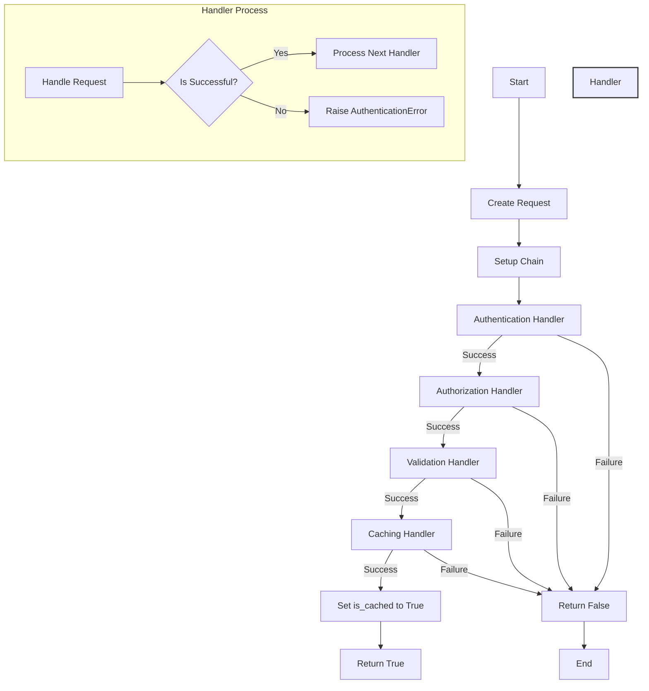
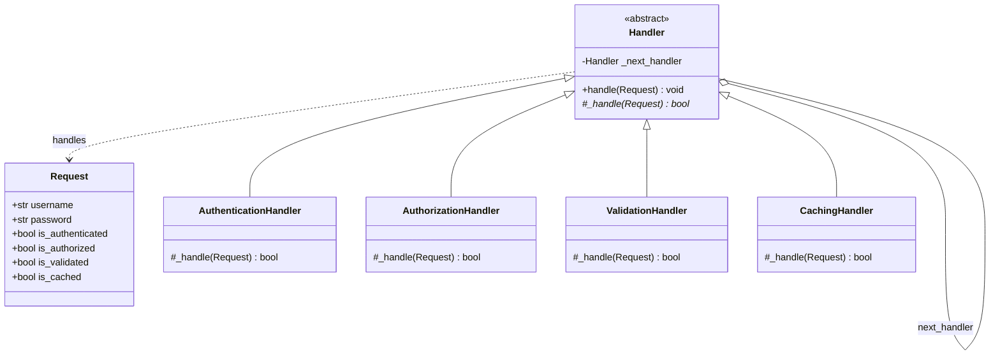

# 概要

Chain Of Responsibility(責任の連鎖)のパターン例を示す.処理をハンドラー単位に分割して連鎖に沿ってリクエストを渡すことができる.各ハンドラーはリクエストを受け取ると、リクエストを処理するか、連鎖内の次のハンドラー遷移を受け付けることができる.

オンライン注文システムの開発において、認証されたユーザーのみが注文を作成できるようにアクセス制限機能を作成する.ただし具体的な認証機能は作成しないものとする.

## ダイアグラム図

### フローチャート図

認証プロセスをハンドラーとして分離して、チェーン連鎖しながら実行することを想定する.


### クラス図

各ハンドラーは初期化時に次のハンドラー情報を持ち、`handle`関数で連鎖処理を記述する.


## 使用例

* 入力

```python
 poetry run python src/main.py
```

* 出力

成功時

```sh
2024-09-22 17:30:58,387 - MyLogger - INFO - start the authentication process
2024-09-22 17:30:58,387 - MyLogger - INFO - Authentication successful
_handleの実行時間: 0.0001秒
2024-09-22 17:30:58,387 - MyLogger - INFO - Authorization successful
_handleの実行時間: 0.0000秒
2024-09-22 17:30:58,387 - MyLogger - INFO - Validation successful
_handleの実行時間: 0.0000秒
2024-09-22 17:30:58,387 - MyLogger - INFO - Caching successful
_handleの実行時間: 0.0000秒
2024-09-22 17:30:58,387 - MyLogger - INFO - {'username': 'admin', 'password': 'password', 'is_authenticated': True, 'is_authorized': True, 'is_validated': True, 'is_cached': True}
```

失敗時

```sh
2024-09-22 17:29:41,661 - MyLogger - INFO - start the authentication process
2024-09-22 17:29:41,661 - MyLogger - ERROR - Invalid username or password
2024-09-22 17:29:41,661 - MyLogger - INFO - {'username': 'admn', 'password': 'password', 'is_authenticated': False, 'is_authorized': False, 'is_validated': False, 'is_cached': False}
```

## 共有事項
