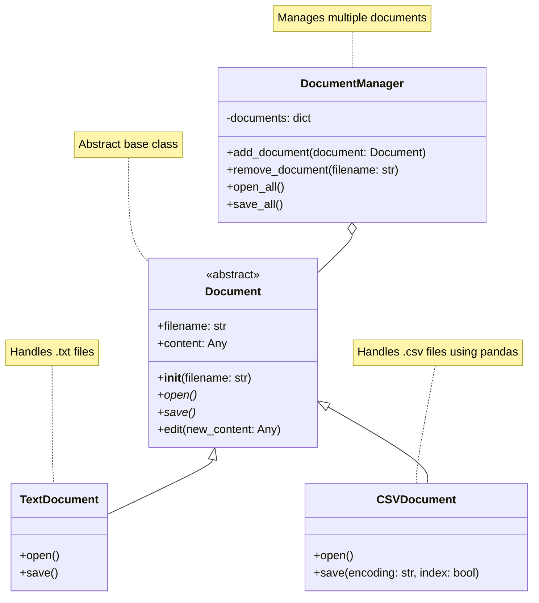

# 概要

抽象基底クラスの共通インターフェースを定義して動作することを促進する


この例では、文書処理システムを簡略化して実装します。新しい種類のドキュメント（例：ExcelDocument）を追加する際に、既存のコードを変更することなく、システムを拡張できます。
このコードを実行すると、各ドキュメントの開く、保存、編集操作がコンソールに出力されます。実際のファイル操作は行われませんが、Abstract Methodパターンの使用方法を示すことができます。

## 入力パラメータ

プログラムは以下の入力パラメータを受け付けます：

| 引数名 | 物理名 | 型 | 必須 | 説明 |
| --- | --- | --- | --- | --- |
| `file` | `--file` | str  | YES  | 解析するファイル名のリスト※ |

※ 本レポジトリのルートディレクトリにある`data/`内に対象のファイルが格納されていること。拡張子は`[".txt", ".csv"]`に限定する。

## ダイアグラム図



## 使用例

* 入力

```python
 poetry run python src/creation/abstract/main.py
 --file "data.csv"
```

* 出力

```sh
```

## 共有事項
