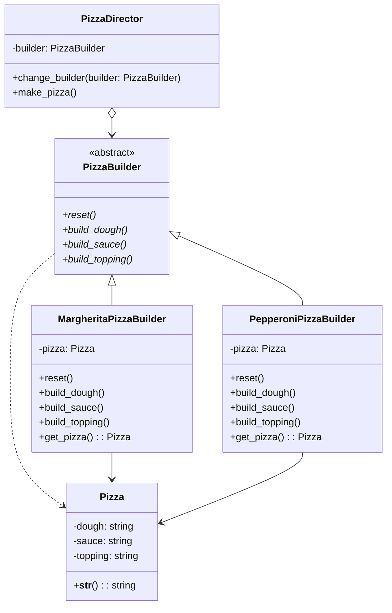

# 概要

複雑なオブジェクトの構築をその表現から切り離して、同じ構築プロセスで異なる表現を生成できるようにします。

Builderパターンを使用してピザの注文システムを実装しています。
このパターンの利点は、複雑なオブジェクト（この場合はピザ）の構築プロセスを分離し、同じ構築プロセスで異なる表現を作成できることです。

## ダイアグラム図



## 使用例

* 入力

```python
 poetry run python src/main.py
```

* 出力

```sh
```

## 共有事項
