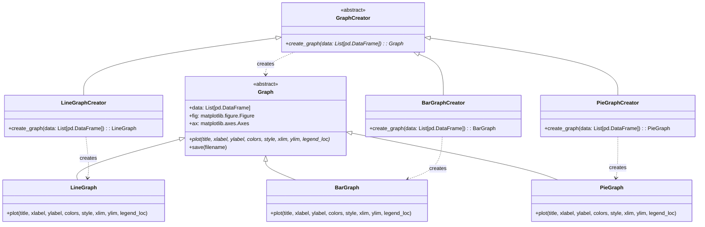

# 概要

オブジェクトクラスのインターフェースを定義して、具体的なクラスのインスタンスをどのクラスにするかはサブクラスで定義する.

この例では、異なる種類のグラフ（折線グラフ、棒グラフ、円グラフ）を作成するファクトリーを実装します。

## ダイアグラム図



## 使用例

* 入力

```python
 poetry run python src/main.py
```

* 出力

```sh
plotの実行時間: 0.0243秒
saveの実行時間: 0.1323秒
2024-09-06 10:54:44,397 - MyLogger - INFO - Graph saved as data/advanced_line_graph.png
plotの実行時間: 0.0138秒
saveの実行時間: 0.1341秒
2024-09-06 10:54:44,563 - MyLogger - INFO - Graph saved as data/advanced_bar_graph.png
plotの実行時間: 0.0107秒
saveの実行時間: 0.1235秒
2024-09-06 10:54:44,716 - MyLogger - INFO - Graph saved as data/advanced_pie_chart.png
```

## 共有事項
