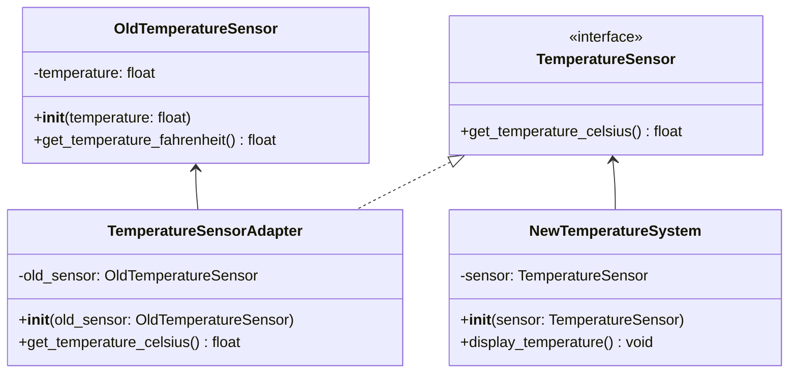

# 概要

すでに存在するクラスをそのまま利用するために、インターフェースを持っていないクラスに対して、インターフェースを実装した新しいクラスを作成する

古い温度計システムと新しい温度計システムを統合するためのアダプターパターンの実装例です

## 入力パラメータ

プログラムは以下の入力パラメータを受け付けます：

| 引数名 | 物理名 | 型 | 必須 | 説明 |
| --- | --- | --- | --- | --- |
| `-f` | `--fahrenheit` | float | YES  | 変換する華氏 |

## ダイアグラム図



## 使用例

* 入力

```python
 poetry run python src/structure/adapter/main.py
 -f 90.6
```

* 出力

```sh
体温は 32.6°C です。
体温は 32.6°C です。
```

## 共有事項
