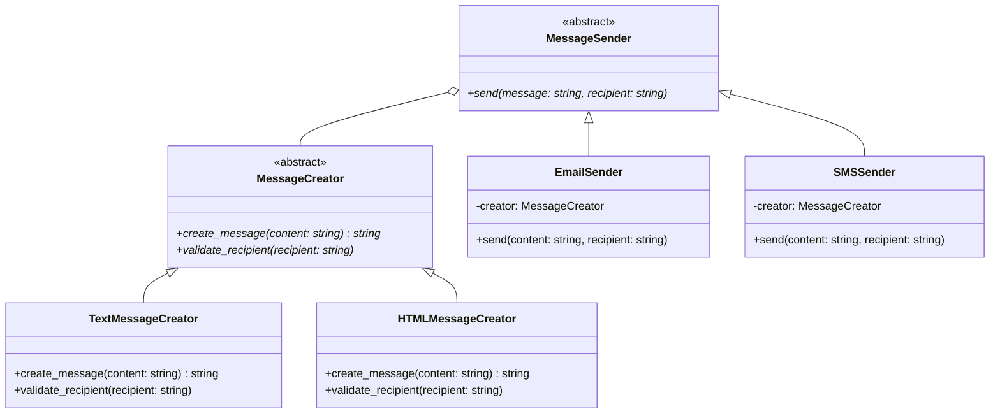

# 概要

抽象化と実装を分離し、それぞれを独立して拡張できるようにするものです。

ここでは、異なる形式でメッセージを送信するシステムを例として使用します。このパターンにより、メッセージの形式（テキスト、HTML）と送信方法（メール、SMS）を柔軟に組み合わせることができます。

## ダイアグラム図



## 使用例

* 入力

```python
 poetry run python src/send.py
```

* 出力

```sh
```

## 共有事項
