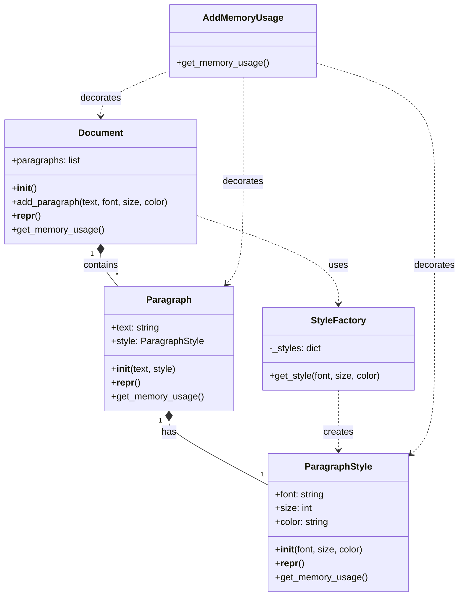

# 概要

flyweightパターンは、多数の類似したオブジェクトを効率的に扱うためのデザインパターンです。共通のデータを共有することで、メモリ使用量を削減し、パフォーマンスを向上させます。

この例では、簡単な文書編集システムをシミュレートします。文書内の各段落にスタイル（フォント、サイズ、色）を適用しますが、flyweightパターンを使用してスタイル情報を効率的に管理します。

## 入力パラメータ

プログラムは以下の入力パラメータを受け付けます：

| 引数名 | 物理名 | 型 | 必須 | 説明 |
| --- | --- | --- | --- | --- |
| `text` | `--text` | str | YES  | 追加するテキスト |
| `font` | `--font` | str | YES | 追加するフォント表記 |
| `size` | `--size` | int | YES | 追加するフォントサイズ |
| `color` | `--color` | str | YES | 追加するフォント色 |

## ダイアグラム図



## 使用例

* 入力

```python
 poetry run python src/structure/flyweight/main.py
 --text "hello, world."
 --font "Arial"
 --size 10
 --color "red"
```

* 出力

```sh
2024-08-10 13:20:30,488 - MyLogger - INFO - ドキュメント全体のメモリ使用量: 1290バイト
2024-08-10 13:20:30,488 - MyLogger - INFO - 一意のスタイル数: 3
mainの実行時間: 0.0005秒
2024-08-10 13:20:30,489 - MyLogger - INFO - update to DB_text_editor.csv.
```

## 共有事項
