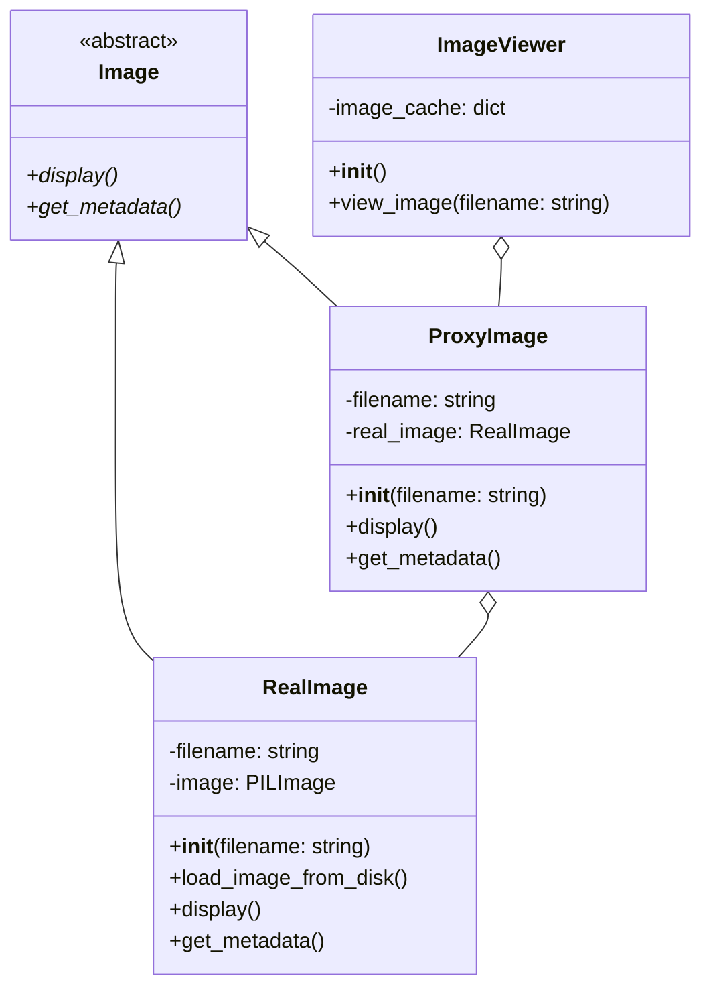

# 概要

Proxyパターンは、あるオブジェクトへのアクセスを制御するためのデザインパターンです。Proxyオブジェクトは、実際のオブジェクト（Real Subject）の代理として機能し、クライアントからのリクエストを制御または管理します。

この例では、大きな画像ファイルを扱うシナリオを想定します。Proxyパターンを使用して、画像の遅延ロードと画像統計データ表示を実装します。

## 入力パラメータ

プログラムは以下の入力パラメータを受け付けます：

| 引数名 | 物理名 | 型 | 必須 | 説明 |
| --- | --- | --- | --- | --- |
| `image` | `--image` | str | YES  | 統計対象となる画像ファイル名※ |

※ 事前に`data/`にアップロードすること.

## ダイアグラム図



## 使用例

* 入力

```python
 poetry run python src/structure/proxy/main.py
 --image "image.png"
```

* 出力

```sh
2024-08-11 15:36:24,219 - MyLogger - INFO - start viewing image processor.
2024-08-11 15:36:24,220 - MyLogger - INFO - Loading data/image_001.jpg from disk...
2024-08-11 15:36:25,668 - MyLogger - INFO - data/image_001.jpg loaded.
2024-08-11 15:36:25,668 - MyLogger - INFO - Displaying data/image_001.jpg
2024-08-11 15:36:25,668 - MyLogger - INFO - Width: 4160px
2024-08-11 15:36:25,668 - MyLogger - INFO - Height: 6240px
2024-08-11 15:36:25,668 - MyLogger - INFO - Format: JPEG
2024-08-11 15:36:25,668 - MyLogger - INFO - Mode: RGB
2024-08-11 15:36:25,668 - MyLogger - INFO - Resolution: 72x72 DPI
mainの実行時間: 1.4491秒
```

## 共有事項
